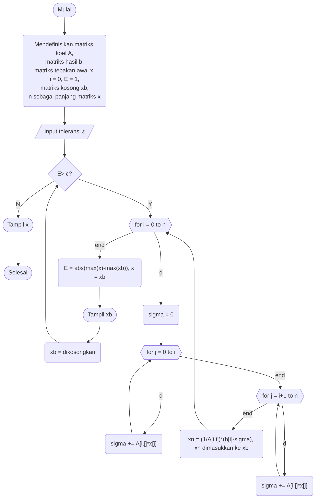
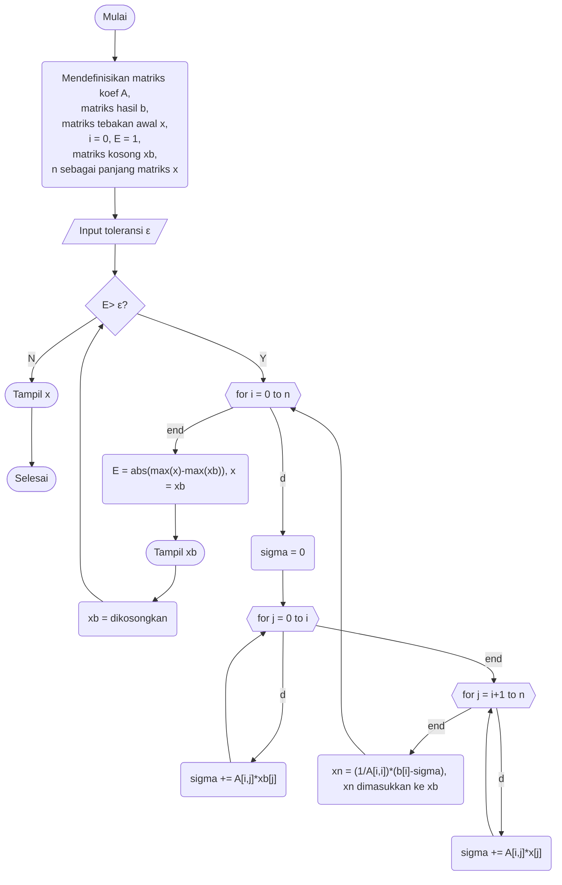
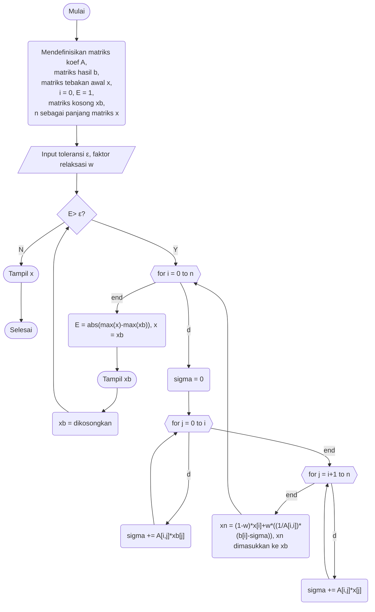

# KN-M3
# Iterasi Jacobi

```mermaid
graph TD;
    A([Mulai])-->B(Mendefinisikan matriks koef A,<br/>matriks hasil b,<br/>matriks tebakan awal x,<br/>i = 0, E = 1,<br/>matriks kosong xb,<br/>n sebagai panjang matriks x);
    B-->C[/Input toleransi ε/];
    C-->D{E> ε?};
    D--Y-->E{{for i = 0 to n}};
    D--N-->O([Tampil x]);
    O-->P([Selesai]);
    E--end-->L("E = abs(max(x)-max(xb)), x = xb");
    L-->M([Tampil xb]);
    M-->N(xb = dikosongkan);
    N-->D;
    E--do-->F(sigma = 0);
    F-->G{{for j = 0 to i}}
    G--do-->H("sigma += A[i,j]*x[j]");
    H-->G;
    G--end-->I{{for j = i+1 to n}};
    I--do-->J("sigma += A[i,j]*x[j]");
    J-->I;
    I--end-->K("xn = (1/A[i,i])*(b[i]-sigma), xn dimasukkan ke xb");
    K-->E;
```
# Iterasi Gauss-Seidel

```mermaid
graph TD;
    A([Mulai])-->B(Mendefinisikan matriks koef A,<br/>matriks hasil b,<br/>matriks tebakan awal x,<br/>i = 0, E = 1,<br/>matriks kosong xb,<br/>n sebagai panjang matriks x);
    B-->C[/Input toleransi ε/];
    C-->D{E> ε?};
    D--Y-->E{{for i = 0 to n}};
    D--N-->O([Tampil x]);
    O-->P([Selesai]);
    E--end-->L("E = abs(max(x)-max(xb)), x = xb");
    L-->M([Tampil xb]);
    M-->N(xb = dikosongkan);
    N-->D;
    E--do-->F(sigma = 0);
    F-->G{{for j = 0 to i}}
    G--do-->H("sigma += A[i,j]*xb[j]");
    H-->G;
    G--end-->I{{for j = i+1 to n}};
    I--do-->J("sigma += A[i,j]*x[j]");
    J-->I;
    I--end-->K("xn = (1/A[i,i])*(b[i]-sigma), xn dimasukkan ke xb");
    K-->E;
```
# Metode SOR (Successive Over Relaxation)

```mermaid
graph TD;
    A([Mulai])-->B(Mendefinisikan matriks koef A,<br/>matriks hasil b,<br/>matriks tebakan awal x,<br/>i = 0, E = 1,<br/>matriks kosong xb,<br/>n sebagai panjang matriks x);
    B-->C[/Input toleransi ε, faktor relaksasi w/];
    C-->D{E> ε?};
    D--Y-->E{{for i = 0 to n}};
    D--N-->O([Tampil x]);
    O-->P([Selesai]);
    E--end-->L("E = abs(max(x)-max(xb)), x = xb");
    L-->M([Tampil xb]);
    M-->N(xb = dikosongkan);
    N-->D;
    E--do-->F(sigma = 0);
    F-->G{{for j = 0 to i}}
    G--do-->H("sigma += A[i,j]*xb[j]");
    H-->G;
    G--end-->I{{for j = i+1 to n}};
    I--do-->J("sigma += A[i,j]*x[j]");
    J-->I;
    I--end-->K("xn = (1-w)*x[i]+w*((1/A[i,i])*(b[i]-sigma)), xn dimasukkan ke xb");
    K-->E;
```
