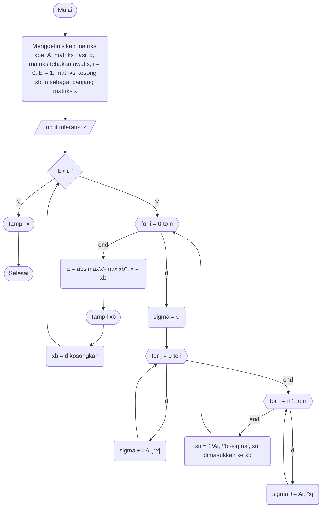

# KN-M3
# Iterasi Jacobi

```mermaid
graph TD;
    A([Mulai])-->B(Mengdefinisikan matriks koef A, matriks hasil b, matriks tebakan awal x, i = 0, E = 1, matriks kosong xb, n sebagai panjang matriks x);
    B-->C[/Input toleransi ε/];
    C-->D{E> ε?};
    D--Y-->E{{for i = 0 to n}};
    D--N-->O([Tampil x]);
    O-->P([Selesai]);
    E--end-->L(E = abs'max'x'-max'xb'', x = xb);
    L-->M([Tampil xb]);
    M-->N(xb = dikosongkan);
    N-->D;
    E--do-->F(sigma = 0);
    F-->G{{for j = 0 to i}}
    G--do-->H(sigma += Ai,j*xj);
    H-->G;
    G--end-->I{{for j = i+1 to n}};
    I--do-->J(sigma += Ai,j*xj);
    J-->I;
    I--end-->K(xn = 1/Ai,i*'bi-sigma', xn dimasukkan ke xb);
    K-->E;
```
